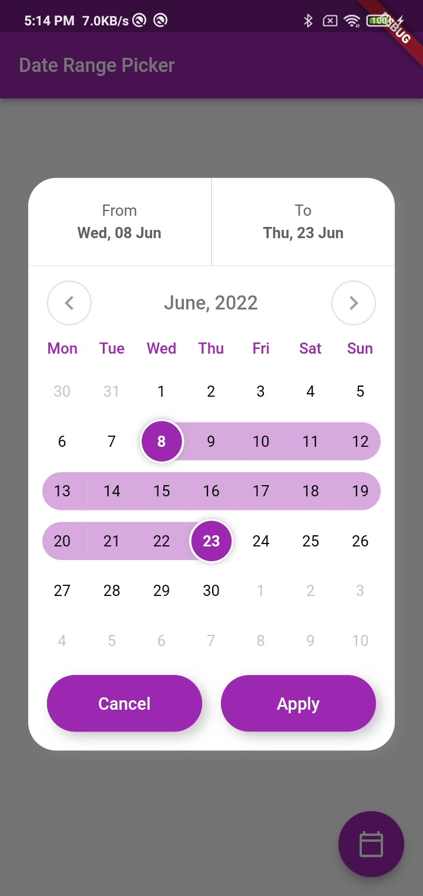

## custom_date_range_picker

I'm happy to share with you this beautiful **custom_date_range_picker**

<p align="center"></p>

To call the CustomDateRangePicker component, you need to pass the following props:

```dart
 floatingActionButton: FloatingActionButton(
        onPressed: () {
          showCustomDateRangePicker(
            context,
            dismissible: true,
            endDate: endDate,
            startDate: startDate,
            onApplyClick: (s, e) {
              setState(() {
                endDate = e;
                startDate = s;
              });
            },
            onCancelClick: () {
              setState(() {
                endDate = null;
                startDate = null;
              });
            },
          );
        },
        tooltip: 'choose date Range',
        child: const Icon(Icons.calendar_today_outlined, color: Colors.white),
      ),
```
